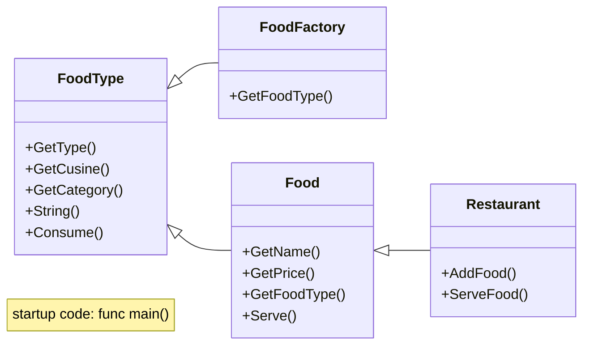

```mermaid
classDiagram
  direction LR
  class FoodFactory {
    +GetFoodType()
  }

  class Restaurant {
    +AddFood()
    +ServeFood()
  }

  class FoodType {
    +GetType()
    +GetCusine()
    +GetCategory()
    +String()
    +Consume()
  }

  class Food {
    +GetName()
    +GetPrice()
    +GetFoodType()
    +Serve()
  }

  FoodType <|-- FoodFactory
  Food <|-- Restaurant
  FoodType <|-- Food
  note "startup code: func main()"
```
