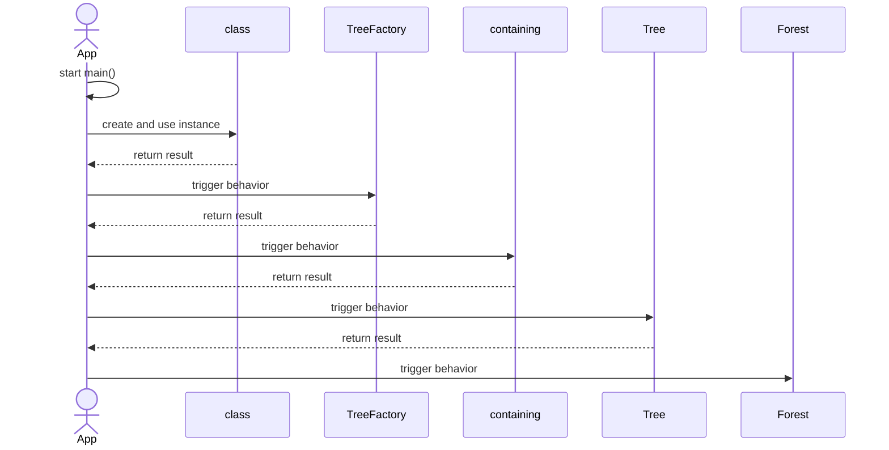

```mermaid
sequenceDiagram
  actor App
  participant class
  participant TreeFactory
  participant containing
  participant Tree
  participant Forest
  App->>App: start main()
  App->>class: create and use instance
  class-->>App: return result
  App->>TreeFactory: trigger behavior
  TreeFactory-->>App: return result
  App->>containing: trigger behavior
  containing-->>App: return result
  App->>Tree: trigger behavior
  Tree-->>App: return result
  App->>Forest: trigger behavior
```
