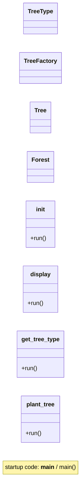

```mermaid
classDiagram
  direction LR
  class TreeType {
  }
  class TreeFactory {
  }
  class Tree {
  }
  class Forest {
  }
  class __init__ {
    +run()
  }
  class display {
    +run()
  }
  class get_tree_type {
    +run()
  }
  class plant_tree {
    +run()
  }
  note "startup code: __main__ / main()"
```
