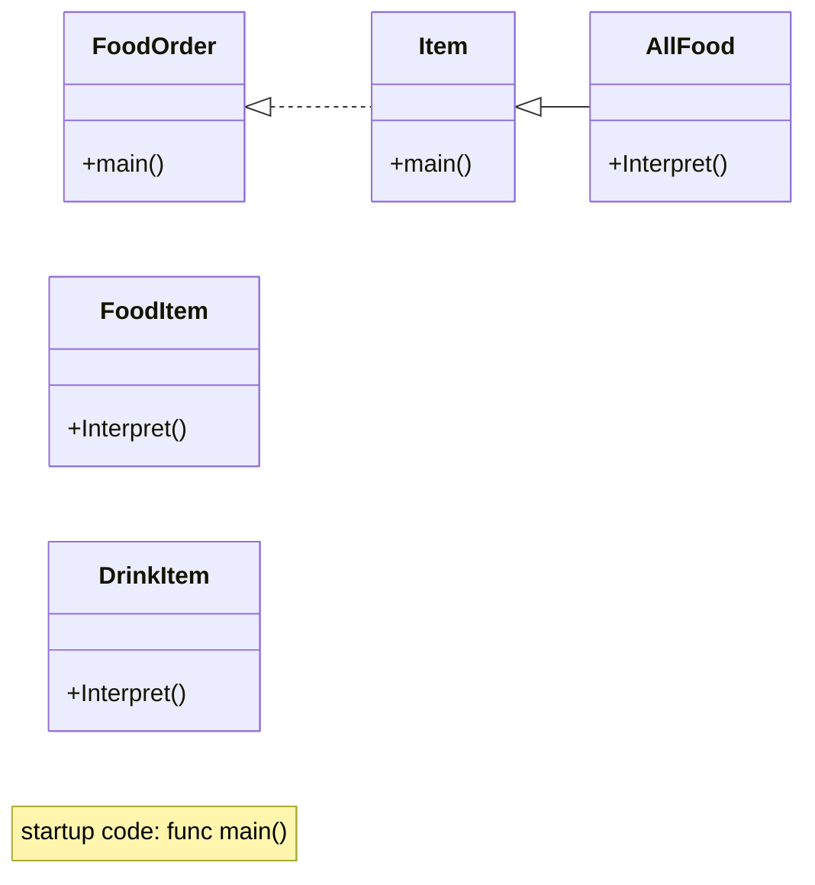

```mermaid
classDiagram
  direction LR
  class AllFood {
    +Interpret()
  }

  class FoodOrder {
    +main()
  }

  class Item {
    +main()
  }

  class FoodItem {
    +Interpret()
  }

  class DrinkItem {
    +Interpret()
  }

  Item <|-- AllFood
  FoodOrder <|.. Item
  note "startup code: func main()"
```
