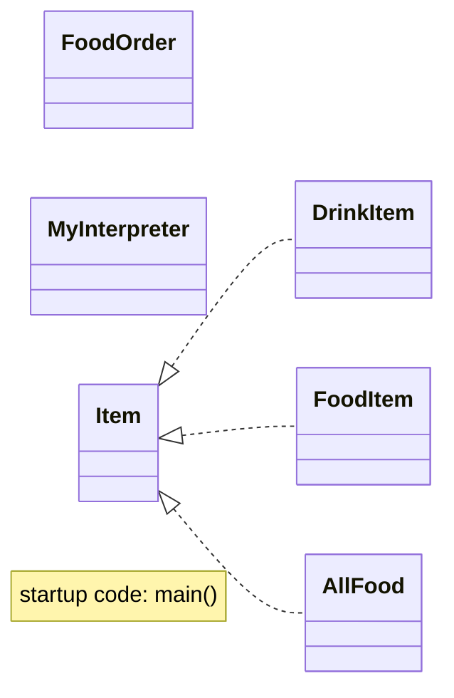

```mermaid
classDiagram
  direction LR
  class DrinkItem {
  }

  class FoodItem {
  }

  class FoodOrder {
  }

  class AllFood {
  }

  class MyInterpreter {
  }

  class Item {
  }

  Item <|.. DrinkItem
  Item <|.. FoodItem
  Item <|.. AllFood
  note "startup code: main()"
```
