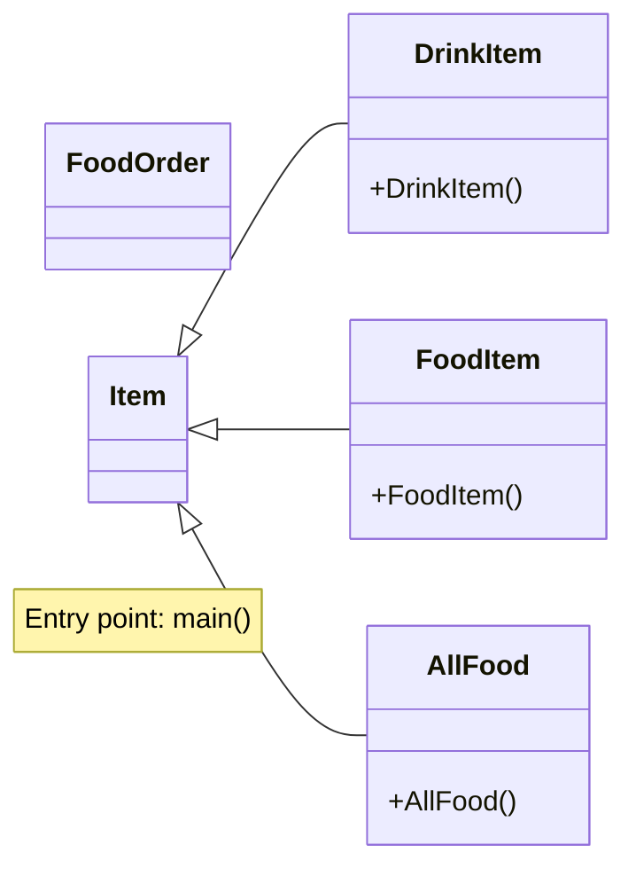

```mermaid
classDiagram
  direction LR

  class FoodOrder

  class Item

  class DrinkItem {
    +DrinkItem()
  }

  class FoodItem {
    +FoodItem()
  }

  class AllFood {
    +AllFood()
  }

  Item <|-- DrinkItem

  Item <|-- FoodItem

  Item <|-- AllFood

  note "Entry point: main()"
```
