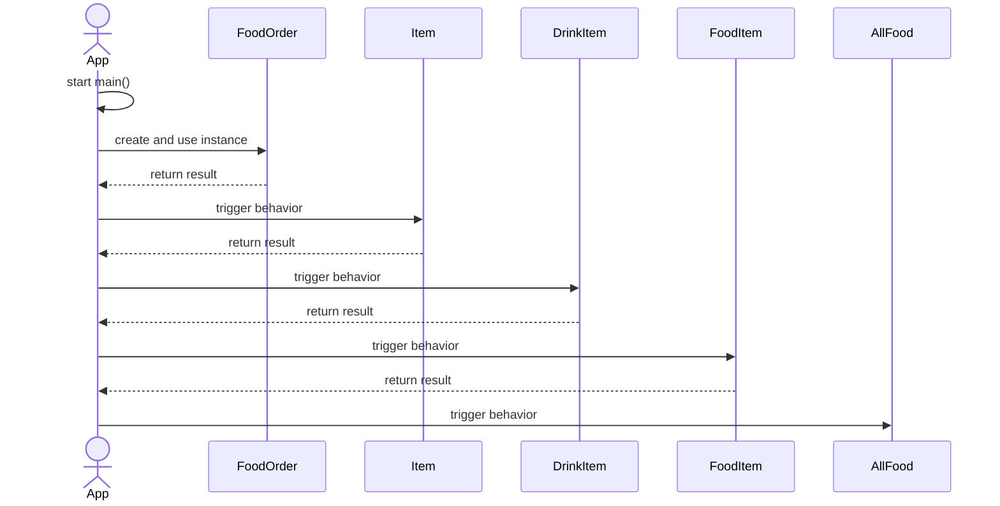

```mermaid
sequenceDiagram
  actor App
  participant FoodOrder
  participant Item
  participant DrinkItem
  participant FoodItem
  participant AllFood
  App->>App: start main()
  App->>FoodOrder: create and use instance
  FoodOrder-->>App: return result
  App->>Item: trigger behavior
  Item-->>App: return result
  App->>DrinkItem: trigger behavior
  DrinkItem-->>App: return result
  App->>FoodItem: trigger behavior
  FoodItem-->>App: return result
  App->>AllFood: trigger behavior
```
