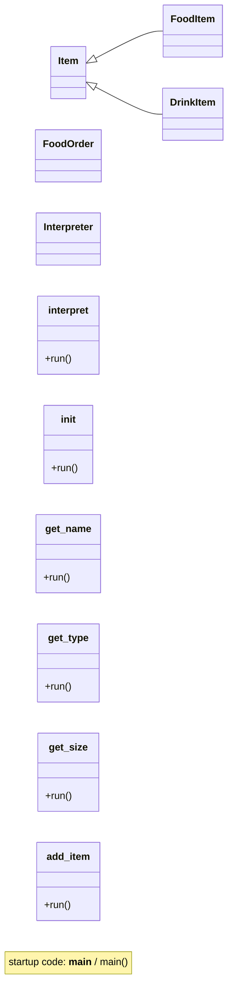

```mermaid
classDiagram
  direction LR
  class Item {
  }
  class FoodItem {
  }
  class DrinkItem {
  }
  class FoodOrder {
  }
  class Interpreter {
  }
  class interpret {
    +run()
  }
  class __init__ {
    +run()
  }
  class get_name {
    +run()
  }
  class get_type {
    +run()
  }
  class get_size {
    +run()
  }
  class add_item {
    +run()
  }
  Item <|-- FoodItem
  Item <|-- DrinkItem
  note "startup code: __main__ / main()"
```
