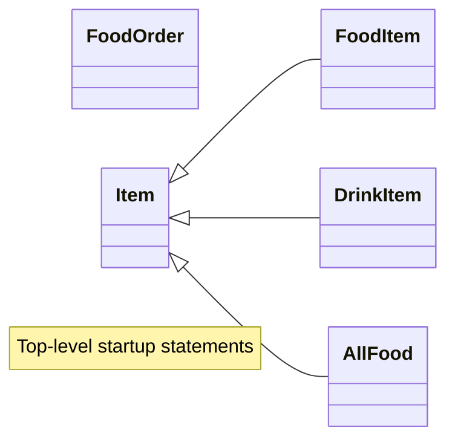

```mermaid
classDiagram
  direction LR
  class FoodOrder {
  }
  class Item {
  }
  class FoodItem {
  }
  class DrinkItem {
  }
  class AllFood {
  }
  Item <|-- FoodItem
  Item <|-- DrinkItem
  Item <|-- AllFood
  note "Top-level startup statements"
```
