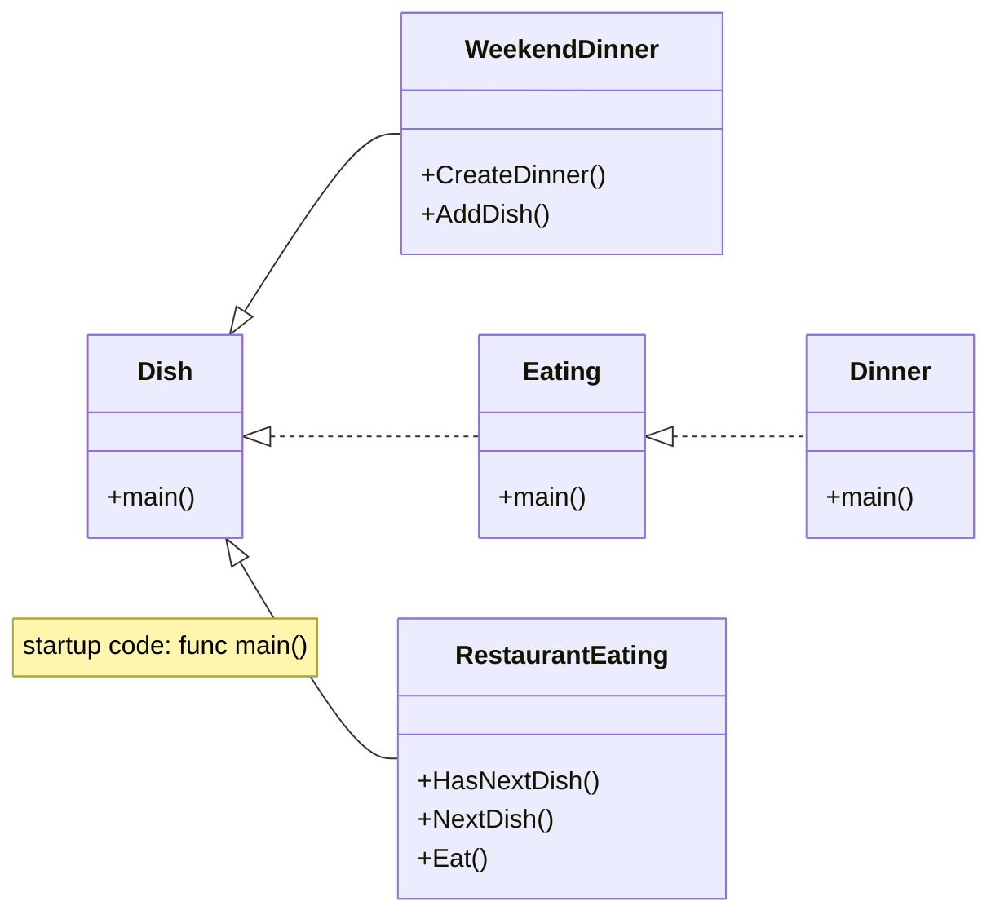

```mermaid
classDiagram
  direction LR
  class Dinner {
    +main()
  }

  class WeekendDinner {
    +CreateDinner()
    +AddDish()
  }

  class Eating {
    +main()
  }

  class RestaurantEating {
    +HasNextDish()
    +NextDish()
    +Eat()
  }

  class Dish {
    +main()
  }

  Eating <|.. Dinner
  Dish <|-- WeekendDinner
  Dish <|.. Eating
  Dish <|-- RestaurantEating
  note "startup code: func main()"
```
