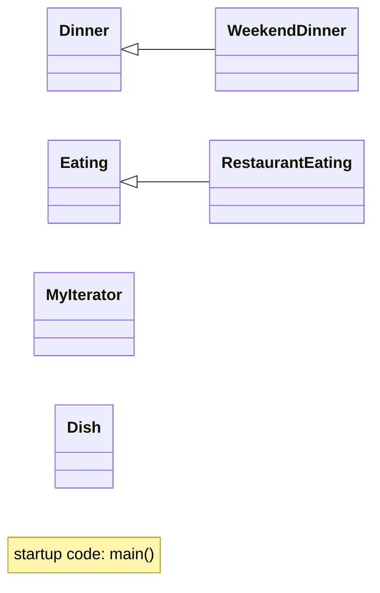

```mermaid
classDiagram
  direction LR
  class Dinner {
  }

  class Eating {
  }

  class RestaurantEating {
  }

  class MyIterator {
  }

  class Dish {
  }

  class WeekendDinner {
  }

  Eating <|-- RestaurantEating
  Dinner <|-- WeekendDinner
  note "startup code: main()"
```
