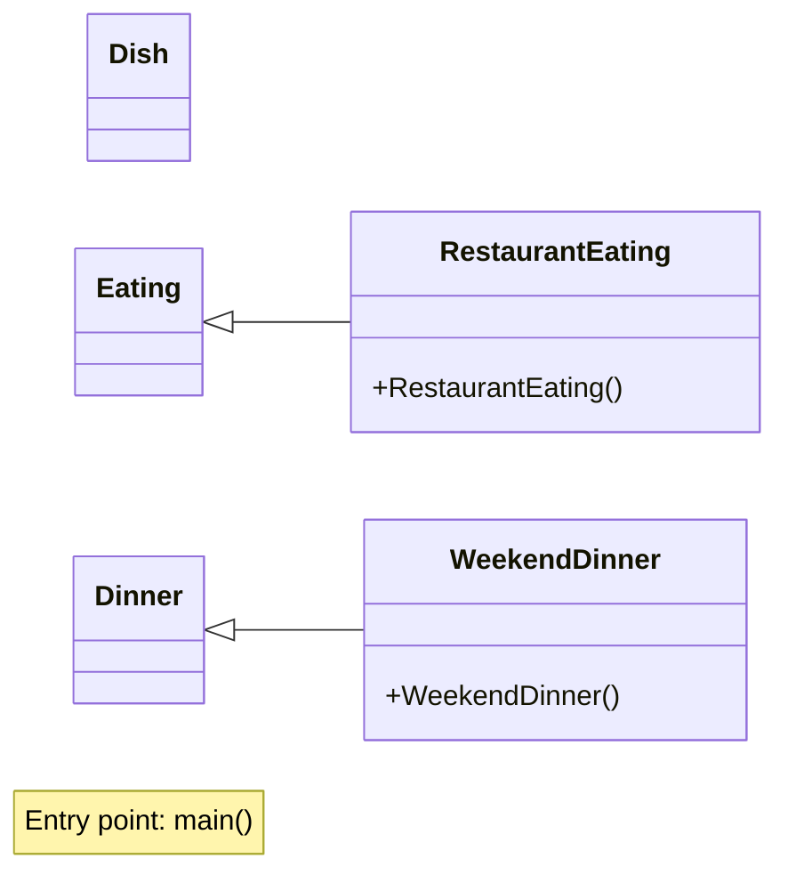

```mermaid
classDiagram
  direction LR

  class Dish

  class Eating

  class RestaurantEating {
    +RestaurantEating()
  }

  class Dinner

  class WeekendDinner {
    +WeekendDinner()
  }

  Eating <|-- RestaurantEating

  Dinner <|-- WeekendDinner

  note "Entry point: main()"
```
