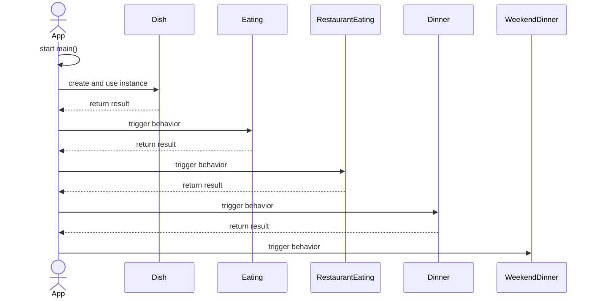

```mermaid
sequenceDiagram
  actor App
  participant Dish
  participant Eating
  participant RestaurantEating
  participant Dinner
  participant WeekendDinner
  App->>App: start main()
  App->>Dish: create and use instance
  Dish-->>App: return result
  App->>Eating: trigger behavior
  Eating-->>App: return result
  App->>RestaurantEating: trigger behavior
  RestaurantEating-->>App: return result
  App->>Dinner: trigger behavior
  Dinner-->>App: return result
  App->>WeekendDinner: trigger behavior
```
