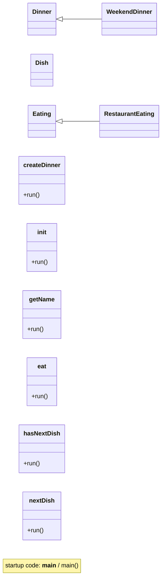

```mermaid
classDiagram
  direction LR
  class Dinner {
  }
  class Dish {
  }
  class Eating {
  }
  class RestaurantEating {
  }
  class WeekendDinner {
  }
  class createDinner {
    +run()
  }
  class __init__ {
    +run()
  }
  class getName {
    +run()
  }
  class eat {
    +run()
  }
  class hasNextDish {
    +run()
  }
  class nextDish {
    +run()
  }
  Eating <|-- RestaurantEating
  Dinner <|-- WeekendDinner
  note "startup code: __main__ / main()"
```
