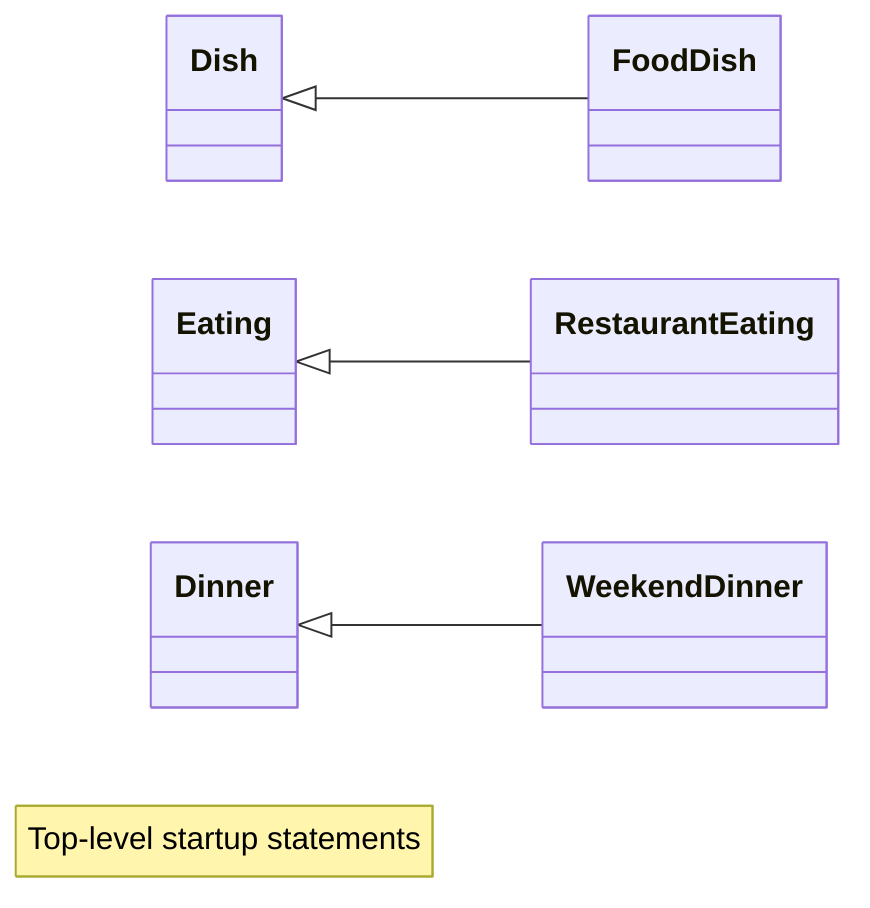

```mermaid
classDiagram
  direction LR
  class Dish {
  }
  class FoodDish {
  }
  class Eating {
  }
  class RestaurantEating {
  }
  class Dinner {
  }
  class WeekendDinner {
  }
  Dish <|-- FoodDish
  Eating <|-- RestaurantEating
  Dinner <|-- WeekendDinner
  note "Top-level startup statements"
```
