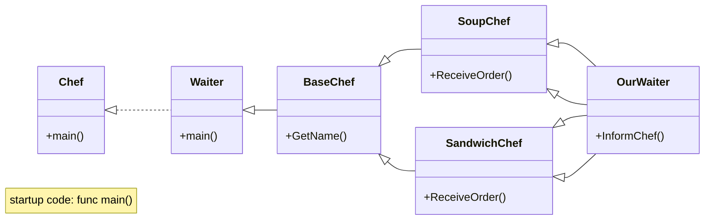

```mermaid
classDiagram
  direction LR
  class SoupChef {
    +ReceiveOrder()
  }

  class SandwichChef {
    +ReceiveOrder()
  }

  class OurWaiter {
    +InformChef()
  }

  class Waiter {
    +main()
  }

  class Chef {
    +main()
  }

  class BaseChef {
    +GetName()
  }

  BaseChef <|-- SoupChef
  BaseChef <|-- SandwichChef
  SoupChef <|-- OurWaiter
  SoupChef <|-- OurWaiter
  SandwichChef <|-- OurWaiter
  SandwichChef <|-- OurWaiter
  Chef <|.. Waiter
  Waiter <|-- BaseChef
  note "startup code: func main()"
```
