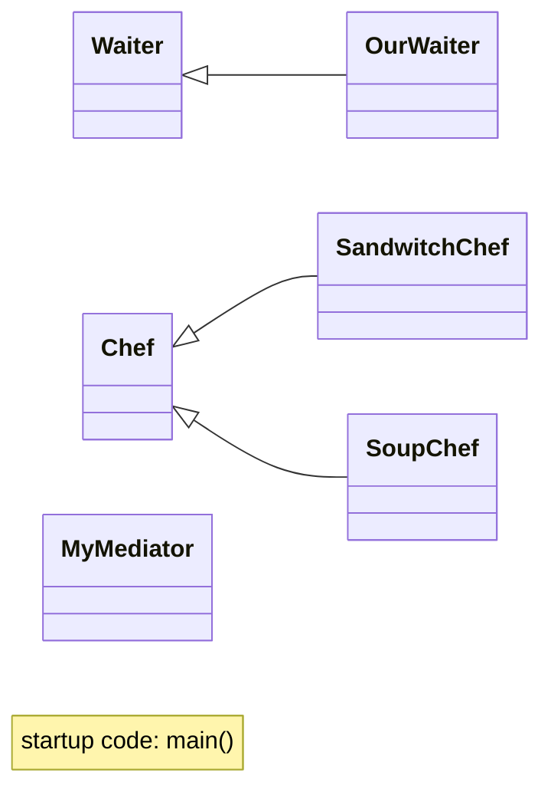

```mermaid
classDiagram
  direction LR
  class Waiter {
  }

  class SandwitchChef {
  }

  class SoupChef {
  }

  class OurWaiter {
  }

  class Chef {
  }

  class MyMediator {
  }

  Chef <|-- SandwitchChef
  Chef <|-- SoupChef
  Waiter <|-- OurWaiter
  note "startup code: main()"
```
