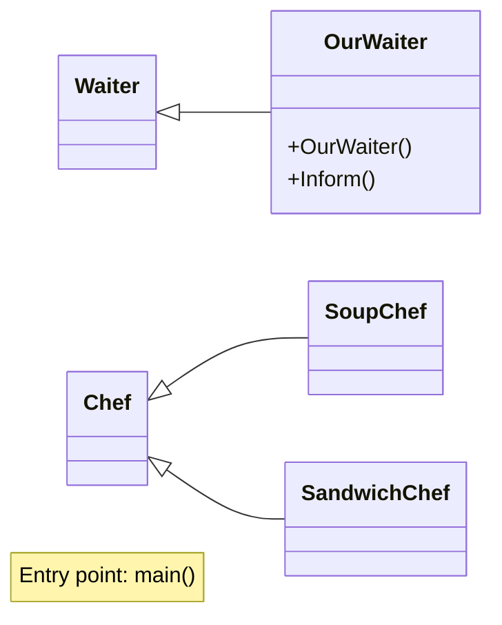

```mermaid
classDiagram
  direction LR

  class Waiter

  class Chef

  class SoupChef

  class SandwichChef

  class OurWaiter {
    +OurWaiter()
    +Inform()
  }

  Chef <|-- SoupChef

  Chef <|-- SandwichChef

  Waiter <|-- OurWaiter

  note "Entry point: main()"
```
