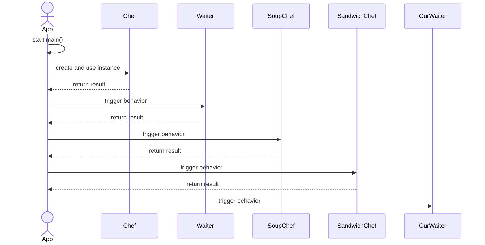

```mermaid
sequenceDiagram
  actor App
  participant Chef
  participant Waiter
  participant SoupChef
  participant SandwichChef
  participant OurWaiter
  App->>App: start main()
  App->>Chef: create and use instance
  Chef-->>App: return result
  App->>Waiter: trigger behavior
  Waiter-->>App: return result
  App->>SoupChef: trigger behavior
  SoupChef-->>App: return result
  App->>SandwichChef: trigger behavior
  SandwichChef-->>App: return result
  App->>OurWaiter: trigger behavior
```
