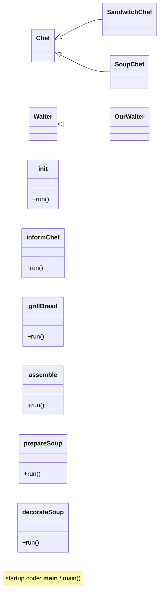

```mermaid
classDiagram
  direction LR
  class Chef {
  }
  class Waiter {
  }
  class SandwitchChef {
  }
  class SoupChef {
  }
  class OurWaiter {
  }
  class __init__ {
    +run()
  }
  class informChef {
    +run()
  }
  class grillBread {
    +run()
  }
  class assemble {
    +run()
  }
  class prepareSoup {
    +run()
  }
  class decorateSoup {
    +run()
  }
  Chef <|-- SandwitchChef
  Chef <|-- SoupChef
  Waiter <|-- OurWaiter
  note "startup code: __main__ / main()"
```
