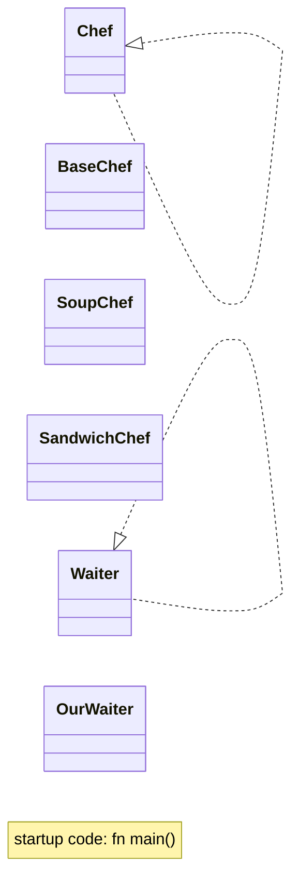

```mermaid
classDiagram
  direction LR
  class Chef {
  }

  class BaseChef {
  }

  class SoupChef {
  }

  class SandwichChef {
  }

  class Waiter {
  }

  class OurWaiter {
  }

  Chef <|.. Chef
  Waiter <|.. Waiter
  note "startup code: fn main()"
```
