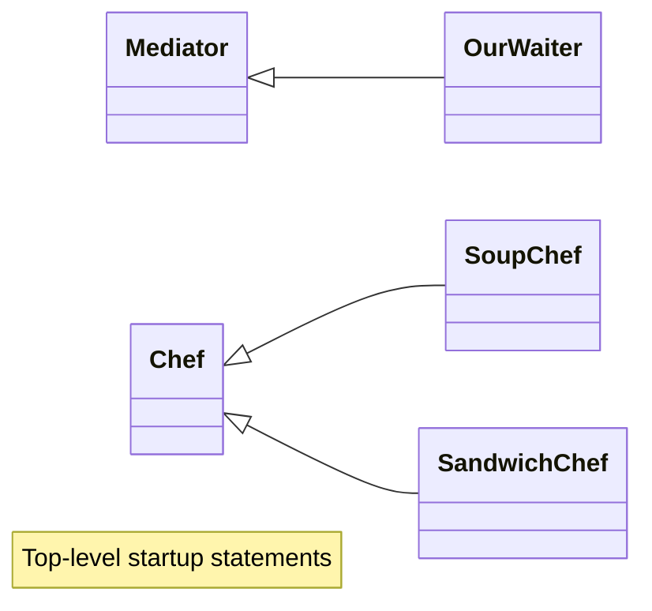

```mermaid
classDiagram
  direction LR
  class Mediator {
  }
  class Chef {
  }
  class SoupChef {
  }
  class SandwichChef {
  }
  class OurWaiter {
  }
  Chef <|-- SoupChef
  Chef <|-- SandwichChef
  Mediator <|-- OurWaiter
  note "Top-level startup statements"
```
