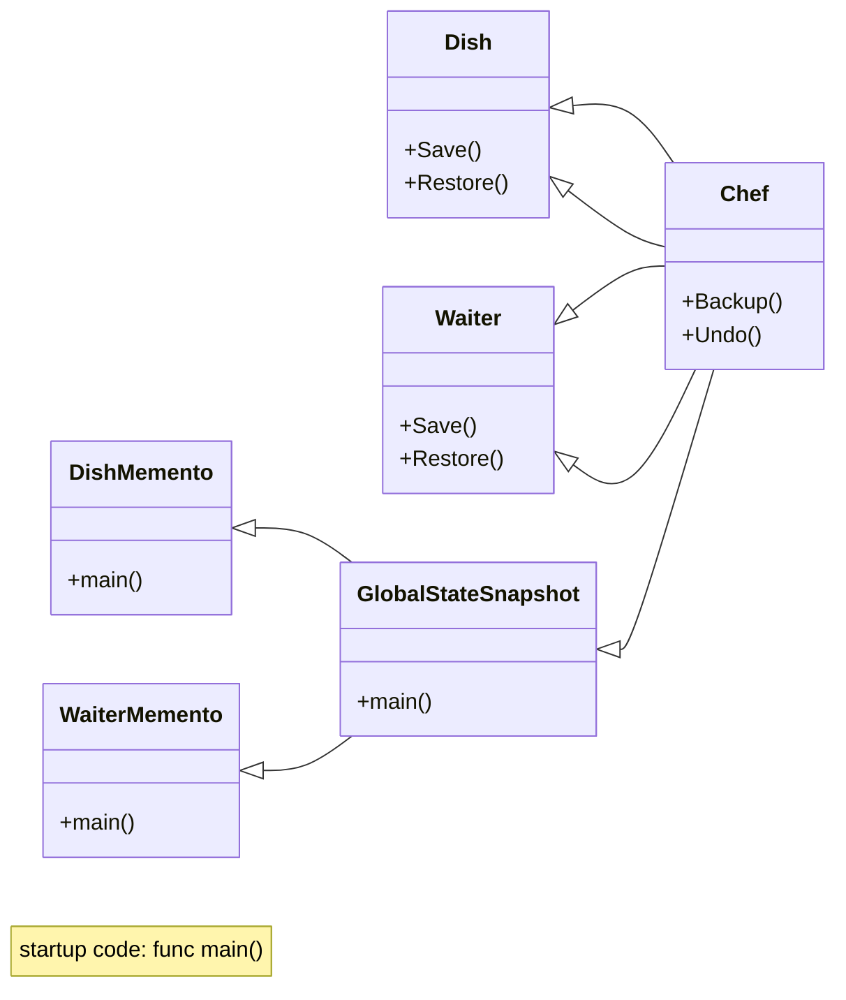

```mermaid
classDiagram
  direction LR
  class Waiter {
    +Save()
    +Restore()
  }

  class WaiterMemento {
    +main()
  }

  class Dish {
    +Save()
    +Restore()
  }

  class DishMemento {
    +main()
  }

  class GlobalStateSnapshot {
    +main()
  }

  class Chef {
    +Backup()
    +Undo()
  }

  DishMemento <|-- GlobalStateSnapshot
  WaiterMemento <|-- GlobalStateSnapshot
  Dish <|-- Chef
  Dish <|-- Chef
  Waiter <|-- Chef
  Waiter <|-- Chef
  GlobalStateSnapshot <|-- Chef
  note "startup code: func main()"
```
