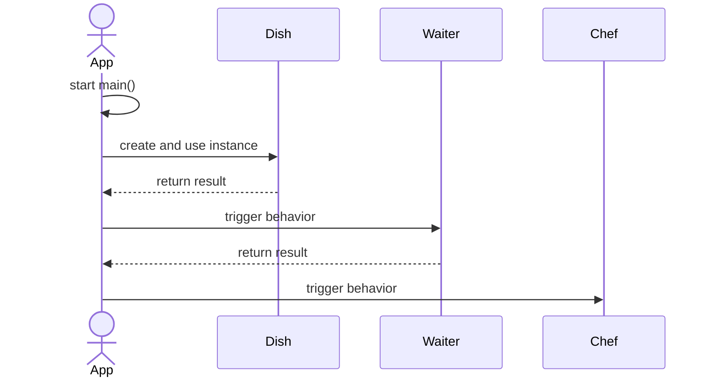

```mermaid
sequenceDiagram
  actor App
  participant Dish
  participant Waiter
  participant Chef
  App->>App: start main()
  App->>Dish: create and use instance
  Dish-->>App: return result
  App->>Waiter: trigger behavior
  Waiter-->>App: return result
  App->>Chef: trigger behavior
```
