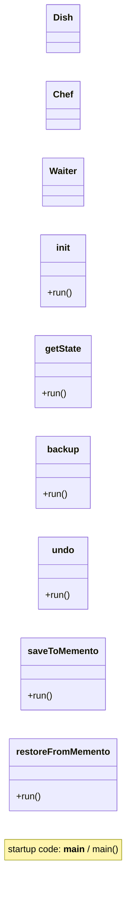

```mermaid
classDiagram
  direction LR
  class Dish {
  }
  class Chef {
  }
  class Waiter {
  }
  class __init__ {
    +run()
  }
  class getState {
    +run()
  }
  class backup {
    +run()
  }
  class undo {
    +run()
  }
  class saveToMemento {
    +run()
  }
  class restoreFromMemento {
    +run()
  }
  note "startup code: __main__ / main()"
```
