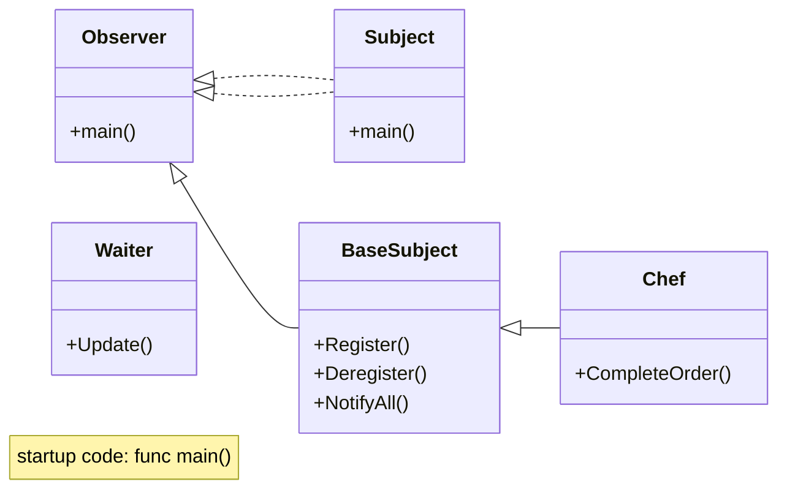

```mermaid
classDiagram
  direction LR
  class Observer {
    +main()
  }

  class Waiter {
    +Update()
  }

  class Subject {
    +main()
  }

  class BaseSubject {
    +Register()
    +Deregister()
    +NotifyAll()
  }

  class Chef {
    +CompleteOrder()
  }

  Observer <|.. Subject
  Observer <|.. Subject
  Observer <|-- BaseSubject
  BaseSubject <|-- Chef
  note "startup code: func main()"
```
