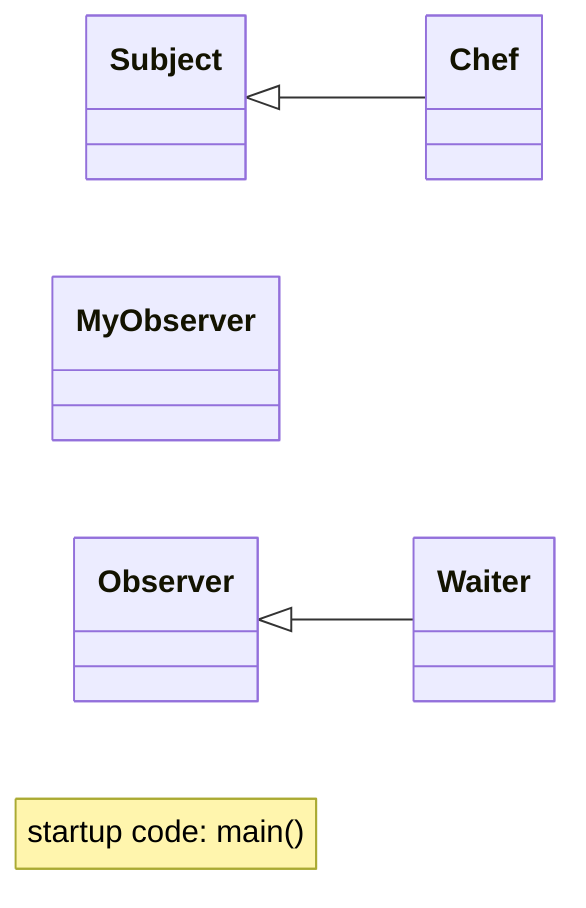

```mermaid
classDiagram
  direction LR
  class Waiter {
  }

  class Subject {
  }

  class Chef {
  }

  class MyObserver {
  }

  class Observer {
  }

  Observer <|-- Waiter
  Subject <|-- Chef
  note "startup code: main()"
```
