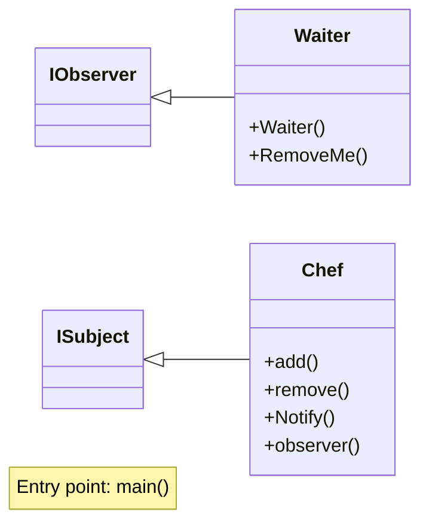

```mermaid
classDiagram
  direction LR

  class IObserver

  class ISubject

  class Chef {
    +add()
    +remove()
    +Notify()
    +observer()
  }

  class Waiter {
    +Waiter()
    +RemoveMe()
  }

  ISubject <|-- Chef

  IObserver <|-- Waiter

  note "Entry point: main()"
```
