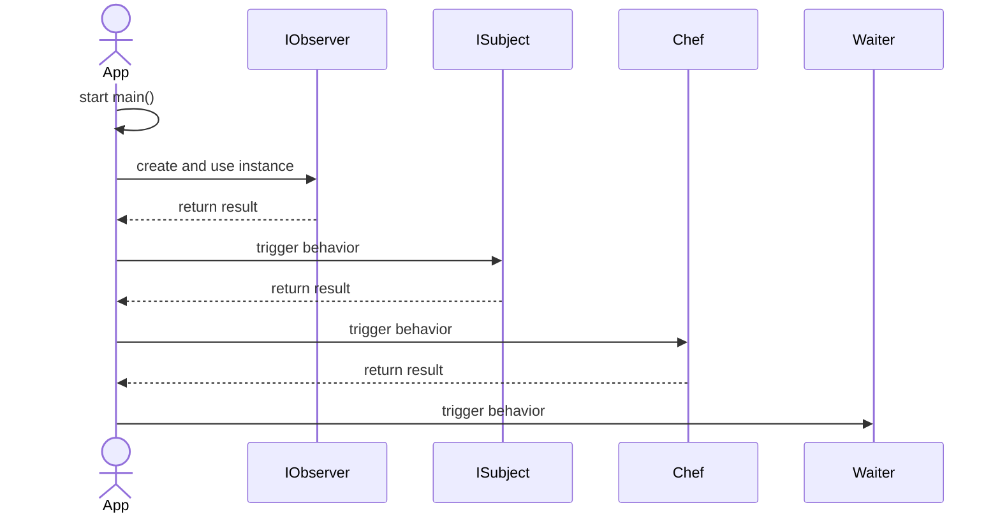

```mermaid
sequenceDiagram
  actor App
  participant IObserver
  participant ISubject
  participant Chef
  participant Waiter
  App->>App: start main()
  App->>IObserver: create and use instance
  IObserver-->>App: return result
  App->>ISubject: trigger behavior
  ISubject-->>App: return result
  App->>Chef: trigger behavior
  Chef-->>App: return result
  App->>Waiter: trigger behavior
```
