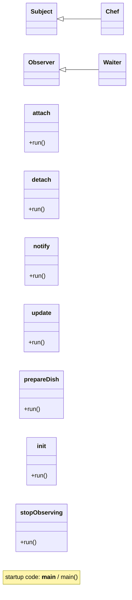

```mermaid
classDiagram
  direction LR
  class Subject {
  }
  class Observer {
  }
  class Chef {
  }
  class Waiter {
  }
  class attach {
    +run()
  }
  class detach {
    +run()
  }
  class notify {
    +run()
  }
  class update {
    +run()
  }
  class prepareDish {
    +run()
  }
  class __init__ {
    +run()
  }
  class stopObserving {
    +run()
  }
  Subject <|-- Chef
  Observer <|-- Waiter
  note "startup code: __main__ / main()"
```
