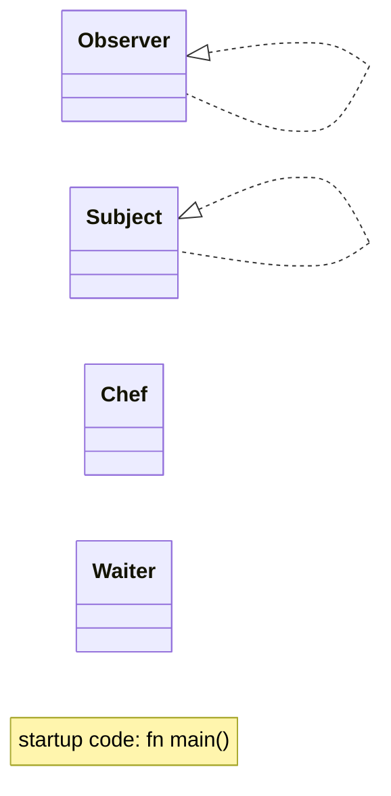

```mermaid
classDiagram
  direction LR
  class Observer {
  }

  class Subject {
  }

  class Chef {
  }

  class Waiter {
  }

  Observer <|.. Observer
  Subject <|.. Subject
  note "startup code: fn main()"
```
