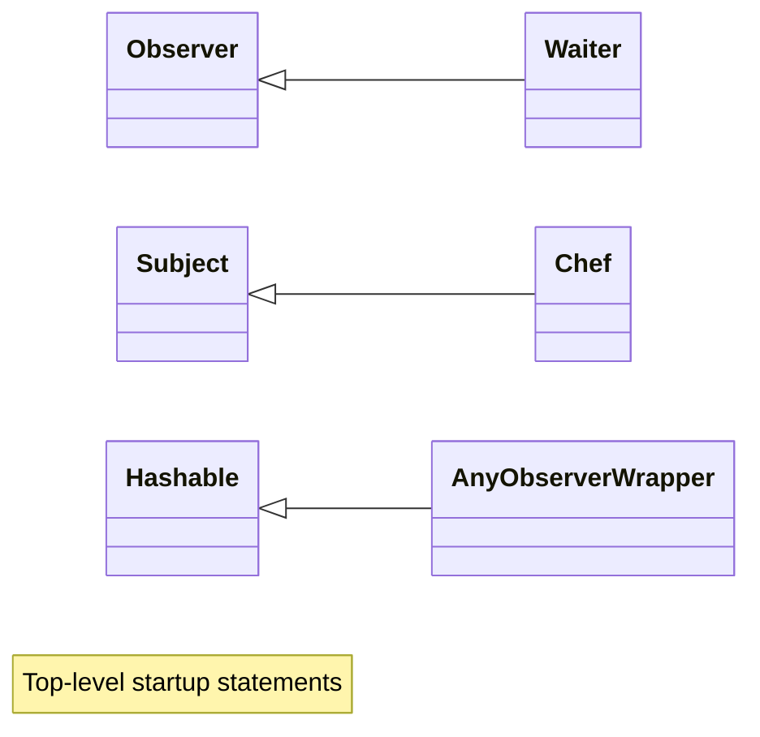

```mermaid
classDiagram
  direction LR
  class Observer {
  }
  class Subject {
  }
  class AnyObserverWrapper {
  }
  class Chef {
  }
  class Waiter {
  }
  Hashable <|-- AnyObserverWrapper
  Subject <|-- Chef
  Observer <|-- Waiter
  note "Top-level startup statements"
```
