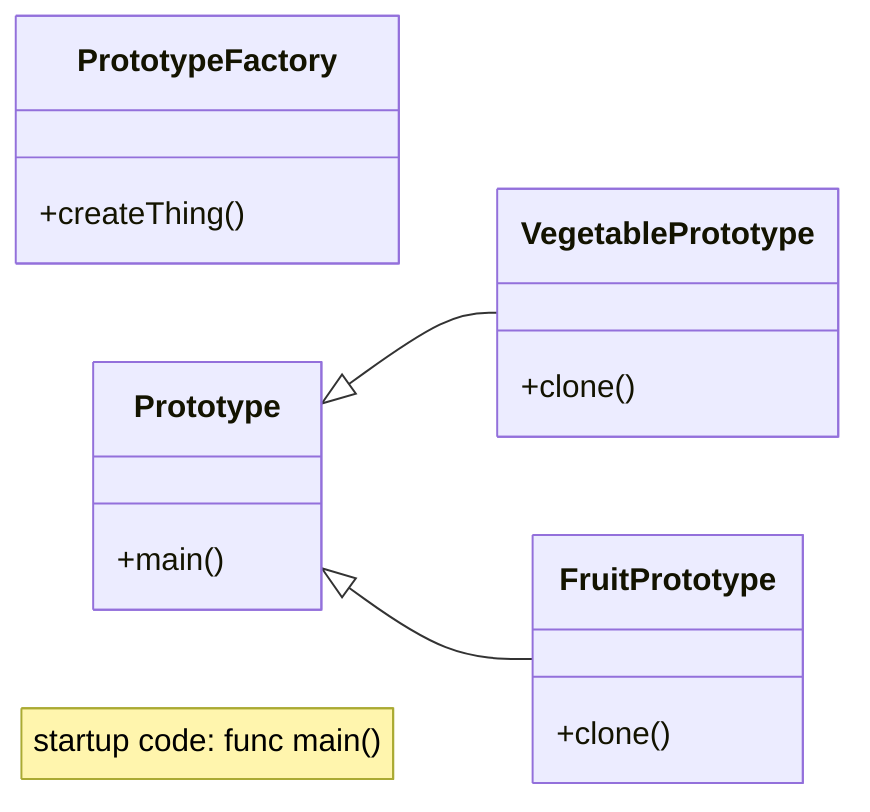

```mermaid
classDiagram
  direction LR
  class VegetablePrototype {
    +clone()
  }

  class FruitPrototype {
    +clone()
  }

  class PrototypeFactory {
    +createThing()
  }

  class Prototype {
    +main()
  }

  Prototype <|-- VegetablePrototype
  Prototype <|-- FruitPrototype
  note "startup code: func main()"
```
