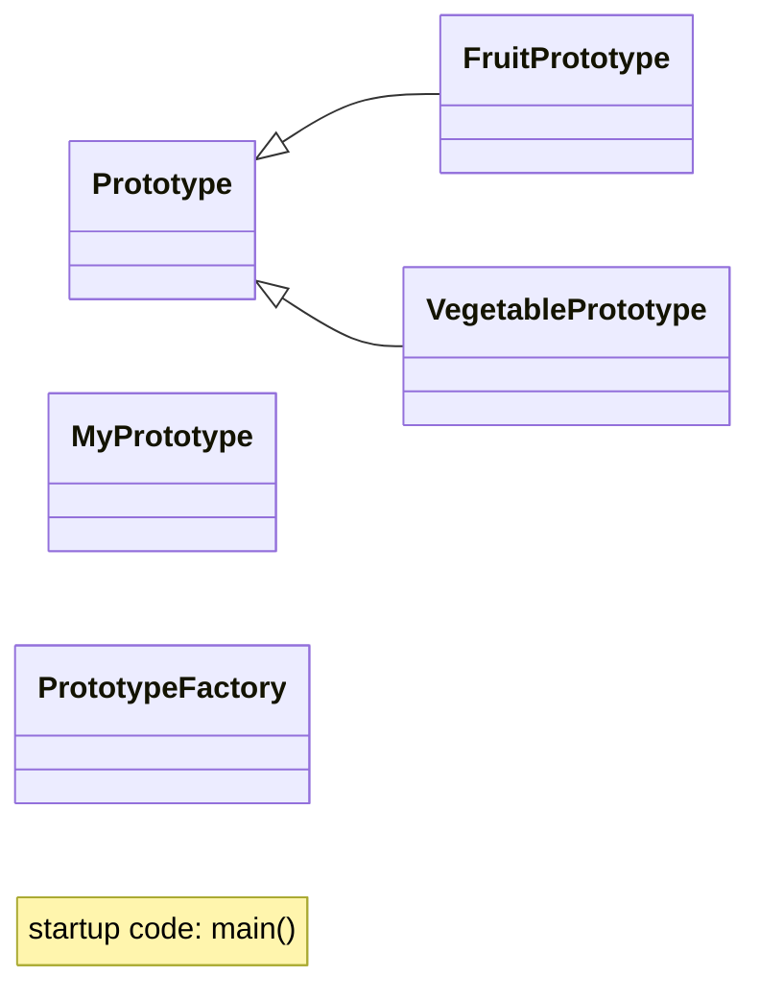

```mermaid
classDiagram
  direction LR
  class Prototype {
  }

  class MyPrototype {
  }

  class PrototypeFactory {
  }

  class FruitPrototype {
  }

  class VegetablePrototype {
  }

  Prototype <|-- FruitPrototype
  Prototype <|-- VegetablePrototype
  note "startup code: main()"
```
