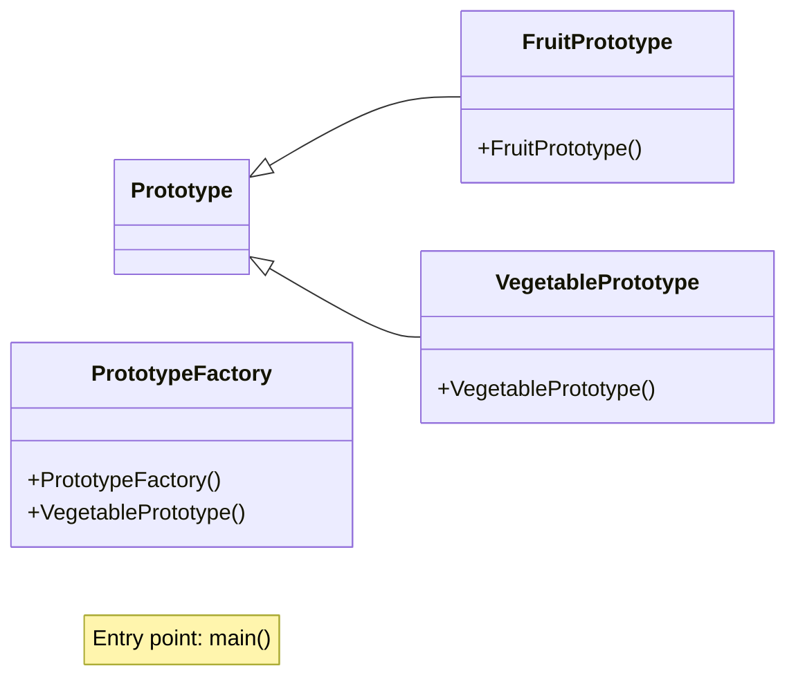

```mermaid
classDiagram
  direction LR

  class Prototype

  class FruitPrototype {
    +FruitPrototype()
  }

  class VegetablePrototype {
    +VegetablePrototype()
  }

  class PrototypeFactory {
    +PrototypeFactory()
    +VegetablePrototype()
  }

  Prototype <|-- FruitPrototype

  Prototype <|-- VegetablePrototype

  note "Entry point: main()"
```
