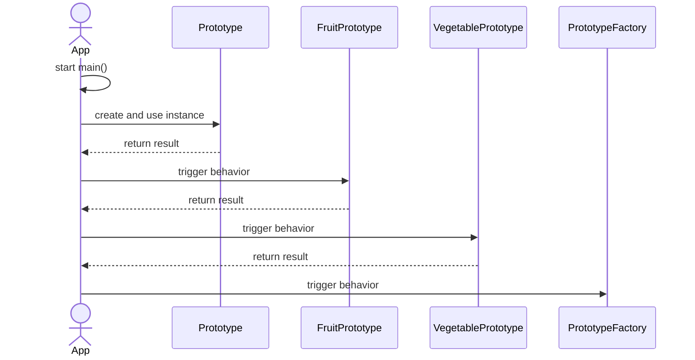

```mermaid
sequenceDiagram
  actor App
  participant Prototype
  participant FruitPrototype
  participant VegetablePrototype
  participant PrototypeFactory
  App->>App: start main()
  App->>Prototype: create and use instance
  Prototype-->>App: return result
  App->>FruitPrototype: trigger behavior
  FruitPrototype-->>App: return result
  App->>VegetablePrototype: trigger behavior
  VegetablePrototype-->>App: return result
  App->>PrototypeFactory: trigger behavior
```
