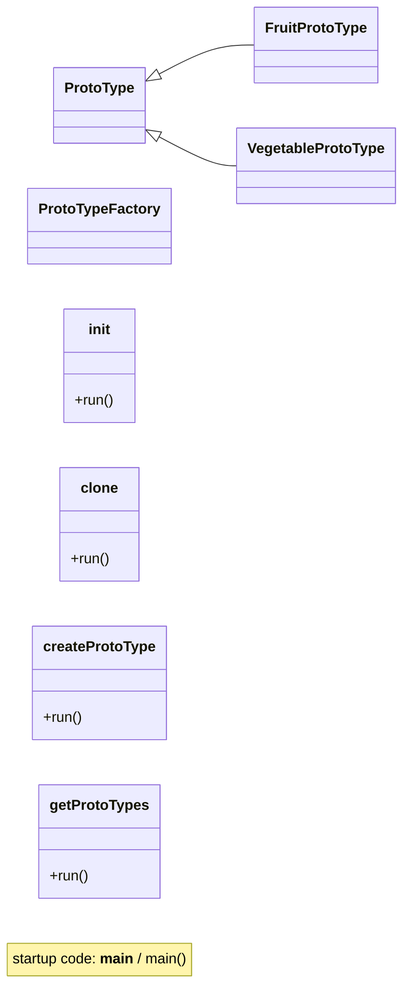

```mermaid
classDiagram
  direction LR
  class ProtoType {
  }
  class FruitProtoType {
  }
  class VegetableProtoType {
  }
  class ProtoTypeFactory {
  }
  class __init__ {
    +run()
  }
  class clone {
    +run()
  }
  class createProtoType {
    +run()
  }
  class getProtoTypes {
    +run()
  }
  ProtoType <|-- FruitProtoType
  ProtoType <|-- VegetableProtoType
  note "startup code: __main__ / main()"
```
