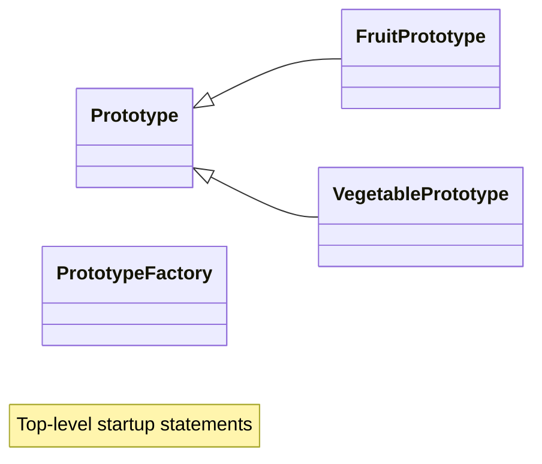

```mermaid
classDiagram
  direction LR
  class Prototype {
  }
  class FruitPrototype {
  }
  class VegetablePrototype {
  }
  class PrototypeFactory {
  }
  Prototype <|-- FruitPrototype
  Prototype <|-- VegetablePrototype
  note "Top-level startup statements"
```
