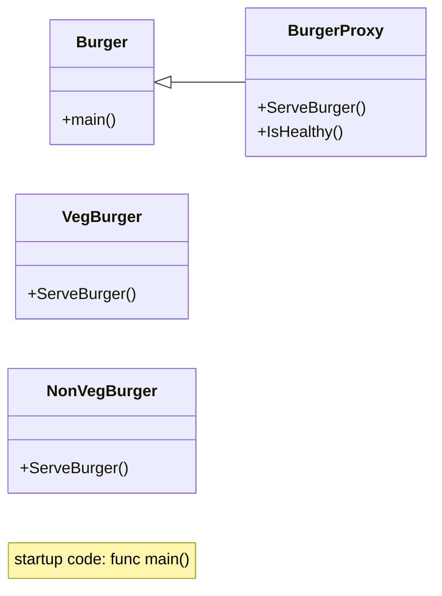

```mermaid
classDiagram
  direction LR
  class Burger {
    +main()
  }

  class VegBurger {
    +ServeBurger()
  }

  class BurgerProxy {
    +ServeBurger()
    +IsHealthy()
  }

  class NonVegBurger {
    +ServeBurger()
  }

  Burger <|-- BurgerProxy
  note "startup code: func main()"
```
