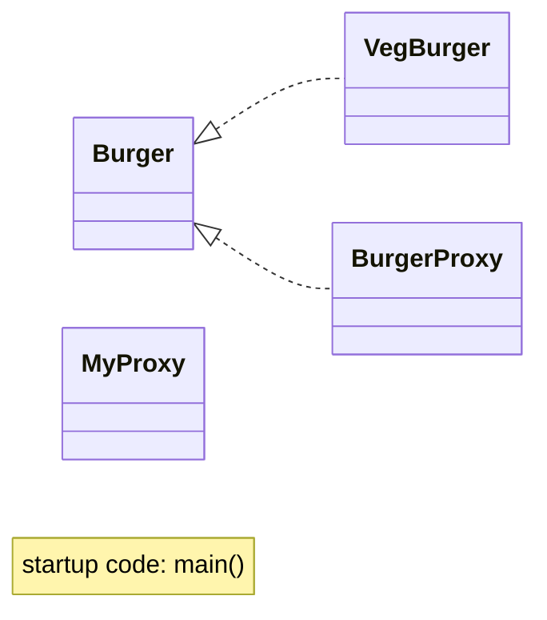

```mermaid
classDiagram
  direction LR
  class Burger {
  }

  class VegBurger {
  }

  class MyProxy {
  }

  class BurgerProxy {
  }

  Burger <|.. VegBurger
  Burger <|.. BurgerProxy
  note "startup code: main()"
```
