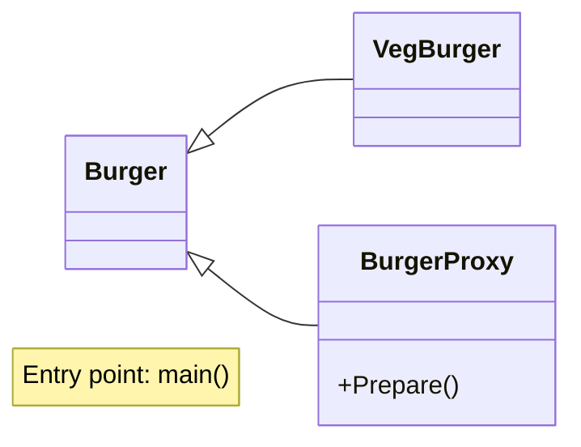

```mermaid
classDiagram
  direction LR

  class Burger

  class VegBurger

  class BurgerProxy {
    +Prepare()
  }

  Burger <|-- VegBurger

  Burger <|-- BurgerProxy

  note "Entry point: main()"
```
