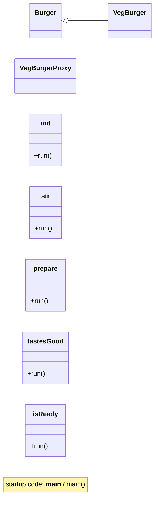

```mermaid
classDiagram
  direction LR
  class Burger {
  }
  class VegBurger {
  }
  class VegBurgerProxy {
  }
  class __init__ {
    +run()
  }
  class __str__ {
    +run()
  }
  class prepare {
    +run()
  }
  class tastesGood {
    +run()
  }
  class isReady {
    +run()
  }
  Burger <|-- VegBurger
  note "startup code: __main__ / main()"
```
