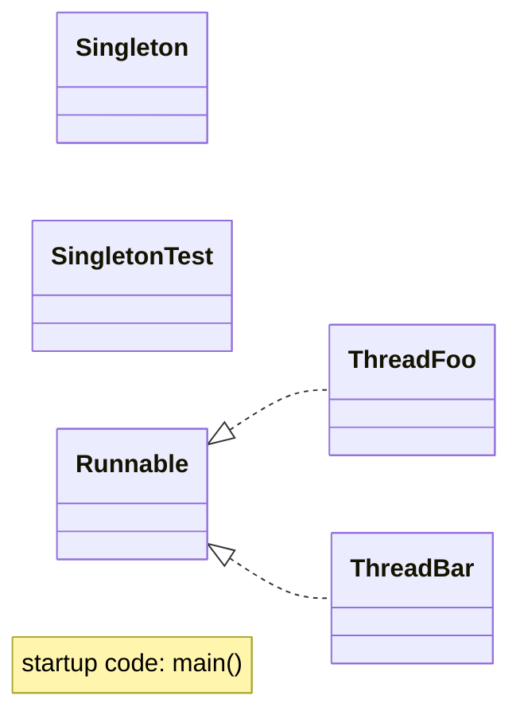

```mermaid
classDiagram
  direction LR
  class Singleton {
  }

  class SingletonTest {
  }

  class ThreadFoo {
  }

  class ThreadBar {
  }

  Runnable <|.. ThreadFoo
  Runnable <|.. ThreadBar
  note "startup code: main()"
```
