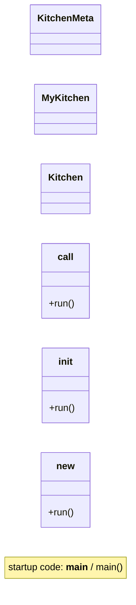

```mermaid
classDiagram
  direction LR
  class KitchenMeta {
  }
  class MyKitchen {
  }
  class Kitchen {
  }
  class __call__ {
    +run()
  }
  class __init__ {
    +run()
  }
  class __new__ {
    +run()
  }
  note "startup code: __main__ / main()"
```
