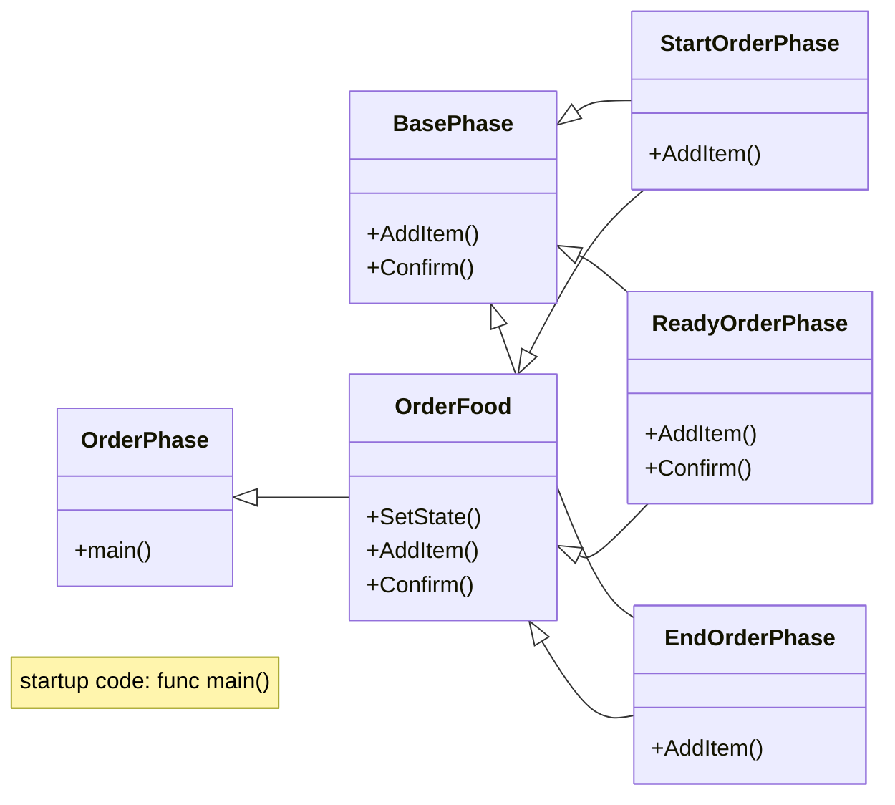

```mermaid
classDiagram
  direction LR
  class OrderPhase {
    +main()
  }

  class BasePhase {
    +AddItem()
    +Confirm()
  }

  class StartOrderPhase {
    +AddItem()
  }

  class ReadyOrderPhase {
    +AddItem()
    +Confirm()
  }

  class EndOrderPhase {
    +AddItem()
  }

  class OrderFood {
    +SetState()
    +AddItem()
    +Confirm()
  }

  BasePhase <|-- StartOrderPhase
  OrderFood <|-- StartOrderPhase
  BasePhase <|-- ReadyOrderPhase
  OrderFood <|-- ReadyOrderPhase
  BasePhase <|-- EndOrderPhase
  OrderFood <|-- EndOrderPhase
  OrderPhase <|-- OrderFood
  note "startup code: func main()"
```
