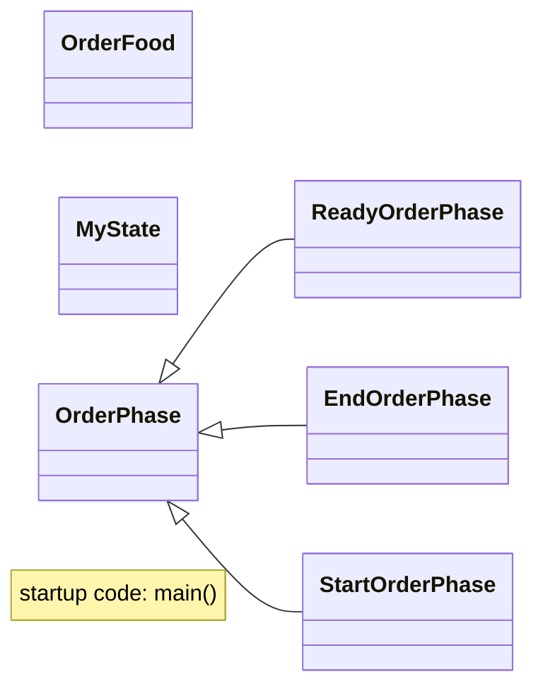

```mermaid
classDiagram
  direction LR
  class OrderFood {
  }

  class ReadyOrderPhase {
  }

  class EndOrderPhase {
  }

  class StartOrderPhase {
  }

  class MyState {
  }

  class OrderPhase {
  }

  OrderPhase <|-- ReadyOrderPhase
  OrderPhase <|-- EndOrderPhase
  OrderPhase <|-- StartOrderPhase
  note "startup code: main()"
```
