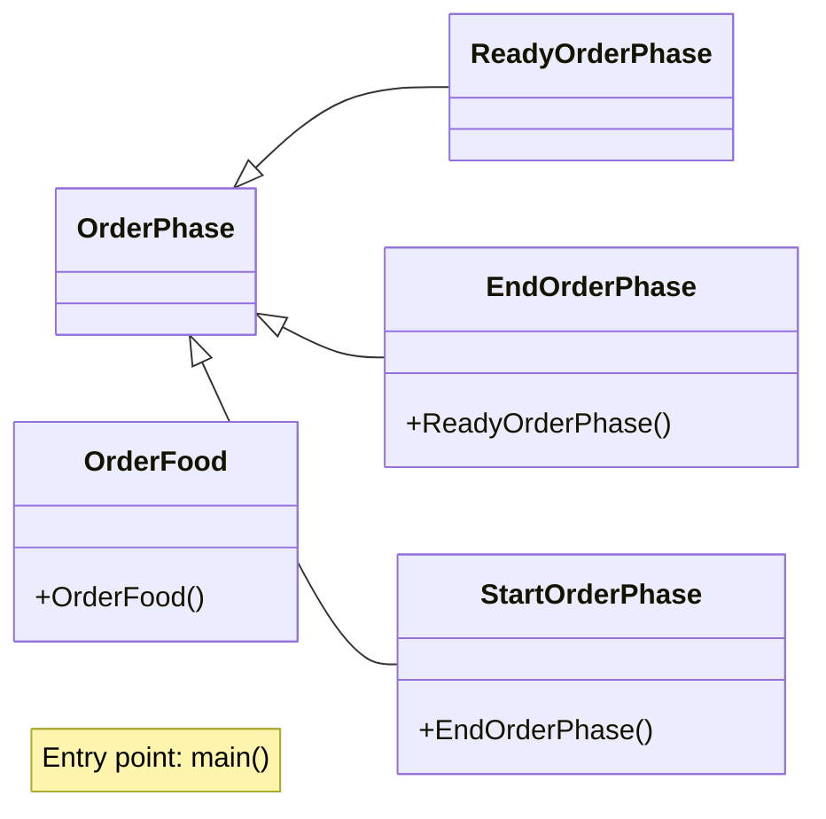

```mermaid
classDiagram
  direction LR

  class OrderPhase

  class OrderFood {
    +OrderFood()
  }

  class ReadyOrderPhase

  class EndOrderPhase {
    +ReadyOrderPhase()
  }

  class StartOrderPhase {
    +EndOrderPhase()
  }

  OrderPhase <|-- ReadyOrderPhase

  OrderPhase <|-- EndOrderPhase

  OrderPhase <|-- StartOrderPhase

  note "Entry point: main()"
```
