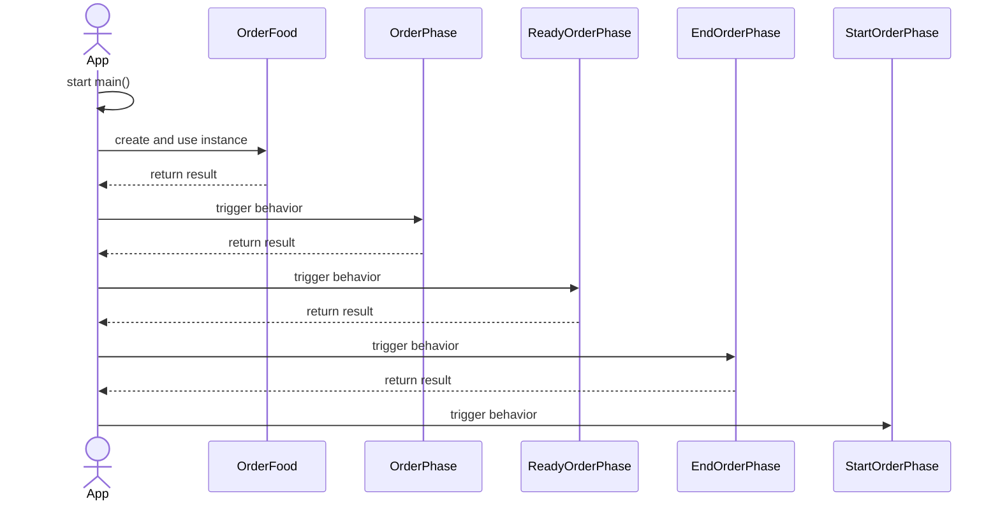

```mermaid
sequenceDiagram
  actor App
  participant OrderFood
  participant OrderPhase
  participant ReadyOrderPhase
  participant EndOrderPhase
  participant StartOrderPhase
  App->>App: start main()
  App->>OrderFood: create and use instance
  OrderFood-->>App: return result
  App->>OrderPhase: trigger behavior
  OrderPhase-->>App: return result
  App->>ReadyOrderPhase: trigger behavior
  ReadyOrderPhase-->>App: return result
  App->>EndOrderPhase: trigger behavior
  EndOrderPhase-->>App: return result
  App->>StartOrderPhase: trigger behavior
```
