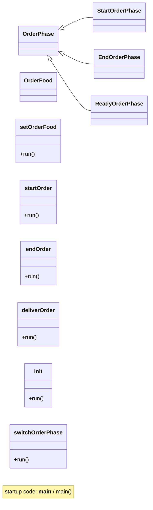

```mermaid
classDiagram
  direction LR
  class OrderPhase {
  }
  class OrderFood {
  }
  class StartOrderPhase {
  }
  class EndOrderPhase {
  }
  class ReadyOrderPhase {
  }
  class setOrderFood {
    +run()
  }
  class startOrder {
    +run()
  }
  class endOrder {
    +run()
  }
  class deliverOrder {
    +run()
  }
  class __init__ {
    +run()
  }
  class switchOrderPhase {
    +run()
  }
  OrderPhase <|-- StartOrderPhase
  OrderPhase <|-- EndOrderPhase
  OrderPhase <|-- ReadyOrderPhase
  note "startup code: __main__ / main()"
```
