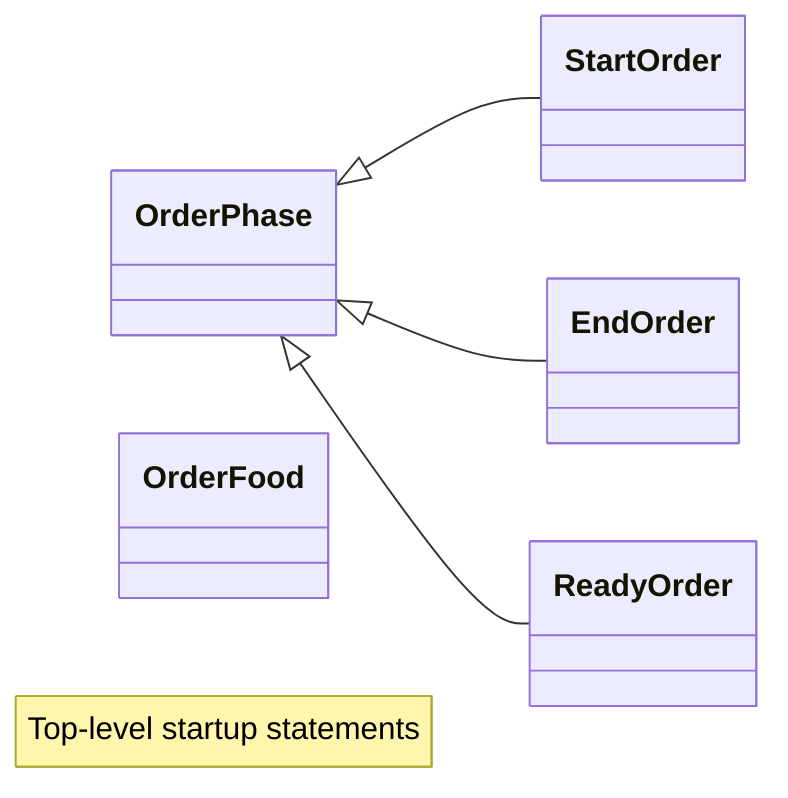

```mermaid
classDiagram
  direction LR
  class OrderPhase {
  }
  class OrderFood {
  }
  class StartOrder {
  }
  class EndOrder {
  }
  class ReadyOrder {
  }
  OrderPhase <|-- StartOrder
  OrderPhase <|-- EndOrder
  OrderPhase <|-- ReadyOrder
  note "Top-level startup statements"
```
